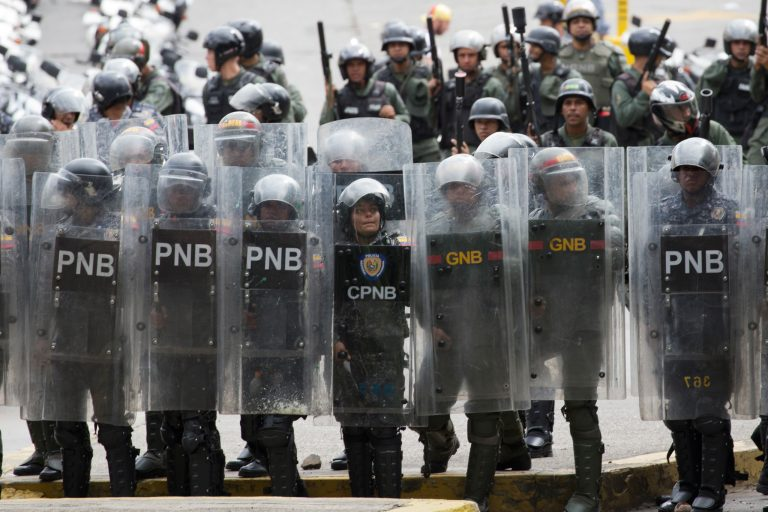
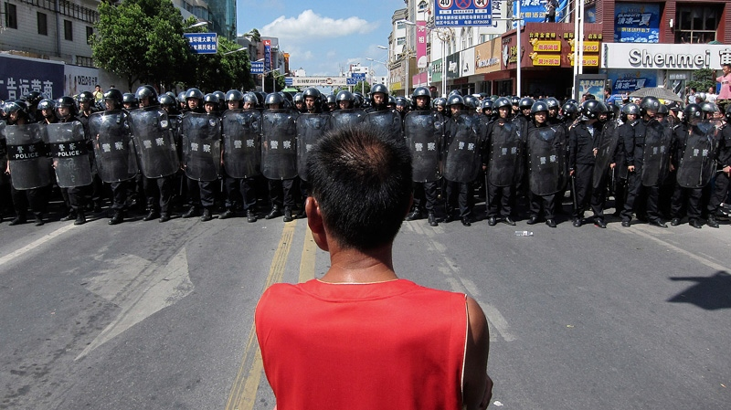
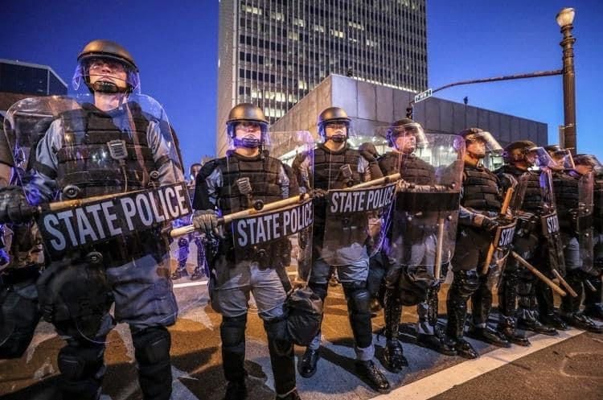

## Chapter 5: The Root Cultural Disease and Life Without It

I grew up in the United States, a culture where I had no influence on the laws I was supposed to live by. I also was absolutely forbidden from upholding the laws of my own culture. It was the police's job to confront anyone who violated the laws, but they had to follow orders, and it always seemed like rich people got away with a lot more than the poor. Everyone seemed to accept this as normal, so I never questioned it growing up. 

I moved all over the United States and visited countries in South America and Europe. Every place I visited, and every country and empire I read about in history books all worked this same way. Normal citizens were forbidden from upholding their own laws and taking a stand against illegal activity, so when illegal behavior happened, people mostly just got stressed out and worried or angry that the government wasn't doing its job.

I often read stories of politicians and wealthy people breaking the law, and when their illegal behavior hurt too many people too much, protests would break out. Maybe the government bailed out the rich and screwed over the poor after a financial collapse, or a factory owner was screwing over workers, or a company had polluted so much land or water that many people's health and jobs were threatened.

I saw these same kind of problems all over the United States, Spain, Russia, China, Brazil, and many similar nations around the worl. And when people came out and protested, demanding justice and to be treated respectfully, what do these people see?

It turns out, in all these unhealthy cultures, people trying to stand up for themselves see a similar response.

In Venezuela, people standing up for themselves and upholding their own law see this:

 
**Riot Police in Venezuela**[xxx-venezuelan riot]

 

In communist China, they see this:

 
**Riot Police in China**[xxx-chinese riot]

 
And in the capitalist United States, they see this:

 
**Riot Police in the United States**[xxx-american riot]

I was always taught growing up that the police's job is to keep people safe and enforce the law. But every time I saw the riot police come out, it seemed like they were protecting the rich and powerful from their poorer neighbors -- people angry about their low wages, pollution, corruption, and all the usual troubles in unhealthy cultures. It's like the police's actual job was to scare people away from standing up for themselves, and punish people for standing in solidarity to make a just society.

Is it any wonder there’s corruption when people aren’t allowed to uphold their own laws and hold their leaders accountable?

All this seemed normal and natural until I found healthy cultures where people don't live this way. I believe every single human feels a deep urge to stand up for what's right in their culture, and unhealthy cultures essentially train people to "hold back" or "shut down" parts of themselves so they won't honor this urge to stand for what's right. In healthy cultures, I believe that standing for what's right in solidarity with neighbors is not just encouraged -- it's expected. Everyone is expected to uphold their laws to ensure they can maintain a respectful way of life.

What would it be like to live in a culture where everyone accepts responsibility to stand for what's right and uphold their laws, each person standing in solidarity with everyone else to ensure no one was mistreated?

### The Nootka Stand in Solidarity

In _Daughters of Copper Woman_, a Nootka storyteller described a cultural technique the Nootka used to help people see their own foolish behavior: clowns. One story about a clown shows what it's like when everyone in a culture stands in solidarity to ensure no one is mistreated.

Now, these weren't clowns with big noses and bright costumes, and they didn't just act silly. Clowns were like magazine opinion writers who commented on all sorts of things. If a clown thought that the council was about to do something foolish, they might show up at council and imitate one of the leaders' every movement so that "every little wart on that person would show, every hole in their idea would suddenly look real big."[xxx-daughters of copper woman|109-112]

If a person were vain about their clothes, a clown might follow behind them wearing tattered rags and their hair would be like a bird's nest full of mud and sticks, all looking similar to the vain person. If a person had a bad temper, a clown might follow and have fits, hitting the sand with a rock or insulting birds and generally looking foolish. If a person became self-important, the clown might follow along babbling like a baby, "until you finally heard what an ass you were bein'." And if a clown started being mean or pushy, a second clown might follow along and let the first clown see how they were showing up.

The Nootka storyteller noted, "nobody would ever dare blow up at the clown!" Anyone who did would be shamed. Clowns did not make fun of people or act hurtfully. They helped people see what they looked like to others and how silly it was to put so much emphasis on unimportant things like clothes or jewelry, "instead of what counts, like bein' nice to people, and bein' lovin'..."

Christians arrived and started dividing up the land. They set up a church, and began trying to get the Nootka to attend, offering mirrors and other trinkets as enticements. At church, the preacher told them what to wear, how to live, and what to do. He insisted that men shouldn't wear kilts, and women should only have long dresses that covered them completely. He kept saying that everyone should live and dress like the white man.

One day, a clown from a nearby community arrived at the church. Like the white man, she wore a big black hat and a black jacket. She even wore old rundown shoes someone had thrown away. Unlike the white man, she wore nothing else. She moved to the front and waited for church to start.

The preacher got very upset, but everyone else looked at her respectfully. No one mocked her or looked away to avoid her nudity.

The preacher started ranting about nudity, naked women, sin, and respect for God. Then he came down from his pulpit and grabbed the clown to throw her out.

Acting violently towards a clown was absolutely not allowed, and the storyteller said, "The people just about ripped him apart." But the clown protected him from the crowd, went up to where the preacher had been, and addressed them in their own language: "She said we were all brothers and sisters... And she said different people had different ways of doin' things, and that didn't mean any one way was Right or any other way was Wrong, it just meant all ways were different."

The clown encouraged empathy, asking people to imagine how a stranger might feel, being away from home, surrounded by people who looked and acted differently. She added, "there was more than one kind of mirror. There was the white man's mirror that you got if you went to church, but there was the mirror in the eyes of the people you loved..." The clown walked out of church, and all the people followed her, leaving the preacher alone. That church still exists and remains empty to this day.

This clown was very brave. I feel impressed that she invited her neighbors to have compassion for a stranger and see his perspective even after he'd acted rudely. I also feel amazed that the people quickly recognized who was in the right and acted in support of the mostly-naked woman instead of the self-righteous man. This story showed me that whole communities can act in solidarity and stand for a culture of mutual respect when conflict arises.

This story showed me what it's like when everyone in a culture upholds the rules for how people treat each other. The Nootka didn't have police; everybody took a stand to protect the clown when she was attacked. They had rules that worked for everyone, and everyone upheld them.

[...outro...]
