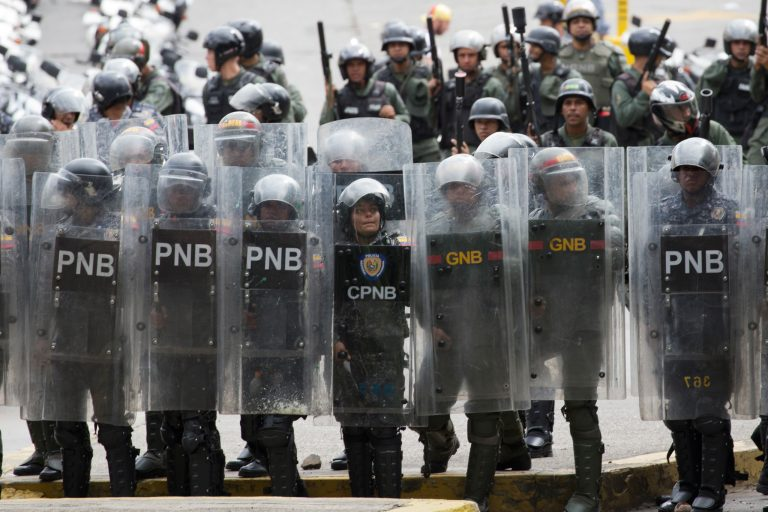
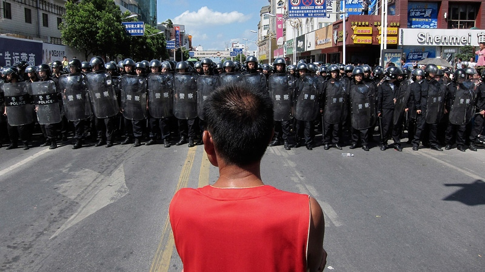
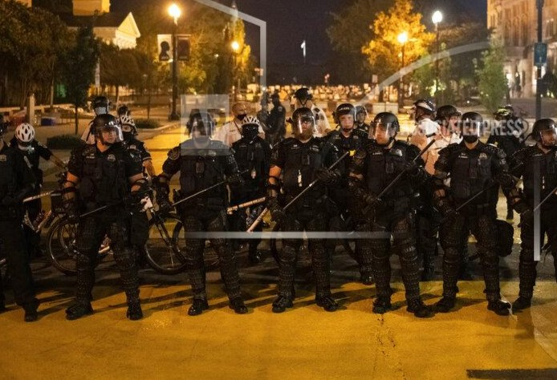

## Chapter 6: Why Are We So Lost?

Everybody is born with a sense of dignity, meaning that we each have a _natural impulse to stand up for what's right_ for ourselves and our neighbors. When people only live by laws they support, that urge to stand for what's right is also the urge to uphold the laws of their society and seek justice.

As I studied healthy nations, I repeatedly saw a common response in times of trouble: people come together, discuss the problem, and consider how to respond collectively so they can return to that respectful way of life that all humans expect from birth.

People born and raised in healthy nations would be shocked if there were rich people, or if their leaders started giving money or special treatment to the rich while others went hungry or lived a precarious life. Or if rich businessmen used violent thugs to suppress people's efforts to get safe working conditions. Or if police arrested someone for saying the truth. Or if a loved one was falsely convicted of a crime, and the racist or sexist judge showed no interest in real justice.

And they would be shocked if they were threatened with severe violence for trying to end these injustices.

But for many of us living in the United States, Spain, Russia, China, Egypt, and every other unhealthy nation around the world, this is not so shocking, is it?

Why does such unjust behavior persist?

### Fierce Resistance to Justice

Countless groups of people have tried countless times over centuries to come together and seek justice. And when they do, what do they face, time and time again?

Regardless of the particular country, or the type of government or economy, whenever and wherever people in unhealthy nations seek justice, they face a similar response.

In socialist Venezuela, when students came together to seek better conditions at their university during an economic crisis in 2018, they saw this:[xxx-venezuela protest reason],[xxx-venezuelan riot]**

 
_Riot Police in Venezuela_

In communist China, when people came together to stop corporations from polluting their rivers in 2012, they saw this:[xxx-chinese riot]**

 
_Riot Police in China_

And in the capitalist United States, when protesters confronted illegal police violence towards black people in 2020, they saw this:[xxx-american riot]**

 
_Riot Police in the United States_

I was taught growing up that the police's job is to keep people safe and enforce the law. But the riot police consistently protect the interests and possessions of the rich and powerful even when they are clearly violating the law.

And who are the police protecting the rich and powerful from? Of course, they are protecting the rich and powerful from people who are angry about low wages, pollution, corruption, wars based on lies, and all the usual injustices in unhealthy nations. The police are actually employed to scare people away from standing up for themselves, and to punish people for collectively seeking justice.

This is what it means to live in an unfree, unhealthy nation: people are threatened and punished for seeking justice for themselves and their neighbors.

In unhealthy nations, where people are forbidden from holding their leaders accountable or standing with others to seek justice, is it any wonder that leaders indulge in corruption and crime?

As I was born and raised in an unhealthy nation, all this seemed normal and natural to me until I discovered healthy nations where people do not live this way.

Every single human feels a deep urge to stand up for what's right, though many have learned to ignore it. _Your urge to "stand for what's right" is your natural desire to uphold the laws of your own nation and seek justice_. In healthy nations, people are expected to act on that urge because they only live with laws that they actually support. In unhealthy nations, people are trained to repress that urge and are punished for acting on it. In addition, many people are forced to live with laws they don't support -- another sign of living in an unfree society.

Unhealthy nations systematically train people from childhood to "hold back" or "shut down" parts of themselves so they won't honor this urge to confront abusive authorities and seek justice.

In healthy nations, standing for what's right in solidarity with neighbors is not just encouraged -- it's expected. Everyone agrees on their laws, and everyone is expected to uphold them to ensure they can maintain a respectful way of life. Children are trained from birth to have the spiritual strength to consistently uphold their laws with integrity.

This shows why so many people of unhealthy nations are lost, with ineffective politics and endless corruption, greed, discrimination, and pollution, no matter who people vote for. When the path to universal justice is outlawed -- because people are forbidden from taking responsibility to choose and uphold their own laws -- injustice and ineffective political movements become normalized.

As long as people accept their own submissive obedience as legitimate, they will be distracted by endless political debates and ignore the root of the problem. People may debate political issues looking at left-wing vs right-wing, republican vs democrat, capitalism vs communism, or monarchy vs democracy, but all these are tyrannical so long as a few people impose the law, and the rest obey it. Only when people stop accepting their own submissive obedience as legitimate can they begin to have meaningful political conversations.

Can you imagine living in a society where everyone accepts responsibility for seeking justice and upholding their laws, with each person acting in solidarity with everyone else to ensure that no one is mistreated? Few people find stories of how whole villages or nations can stand in solidarity, so let's look at an example so you know what it's like.**

Revolutionary Activity #9 Practice standing for what's right

When you act on your urge to stand for what's right, you bring justice, connection, and understanding into the world. Think about a time you saw someone disrespected, misunderstood, cheated, or attacked, whether on TV or in person. How did you respond? How could you have taken a stand to make the situation turn out better? Look for another instance where someone around you is disrespected, and find a way to help address the disrespect so it doesn't happen again.

### The Nootka Stand in Solidarity

In healthy nations, everyone upholds their laws as a normal way of life, protecting each other whenever the need arises. One story from the Nootka illustrates what life is like when everyone stands in solidarity to ensure no one is disrespected.

In the book _Daughters of Copper Woman_, a Nootka storyteller described a cultural technique the Nootka used to help people see their own foolish behavior: people who acted like mirrors, helping other people see their own silly or foolish behavior by imitating it.[xxx-daughters of copper woman|109]

These "mirror" people were like magazine opinion writers who commented on all sorts of things. If a mirror thought that the council was about to do something foolish, they might show up at council and imitate one of the leader's every moves so that "every little wart on that person would show, every hole in their idea would suddenly look real big."

If a person were vain about their clothes, a mirror might follow behind them wearing tattered rags and their hair would be like a bird's nest full of mud and sticks, all looking similar to the vain person. If a person had a bad temper, a mirror might follow and have fits, hitting the sand with a rock or insulting birds and generally looking foolish. If a person became self-important, the mirror might follow along babbling like a baby, "until you finally heard what an ass you were bein'." And if a mirror started being mean or pushy, a second mirror might follow along and let the first one see how they were showing up.

The Nootka storyteller noted, "nobody would ever dare blow up at the [mirror]!" Anyone who did would be shamed. Mirrors did not make fun of people or act hurtfully. They helped people see what they looked like to others and how ridiculous it was to put so much emphasis on unimportant things like clothes or jewelry, "instead of what counts, like bein' nice to people, and bein' lovin'..."

Christians arrived and started dividing up the land. They set up a church, and began trying to get the Nootka to attend, offering glass mirrors and other trinkets as enticements. At church, the preacher told them what to wear, how to live, and what to do. He insisted that men shouldn't wear kilts, and women should only have long dresses that covered them completely. He kept saying that everyone should live and dress like the white man.

One day, a mirror woman from a nearby community arrived at the church. Like the white man, she wore a big black hat and a black jacket. She even wore old rundown shoes someone had thrown away. Unlike the white man, she wore nothing else. 

She moved to the front and waited for church to start.

The preacher got very upset, but everyone else looked at her respectfully. No one mocked her or looked away to avoid her nakedness.

The preacher started ranting about nudity, naked women, sin, and respect for God. Then he came down from his pulpit and grabbed the mirror to throw her out!

Acting violently towards a mirror was absolutely not allowed, and the storyteller said, "The people just about ripped him apart." But the mirror protected him from the crowd, went up to where the preacher had been, and began speaking.

The mirror first encouraged empathy, asking people to imagine how a stranger might feel, being away from home and surrounded by people who looked and acted differently. Then she reminded her neighbors of the beauty of their respectful way of life when she said, "there was more than one kind of mirror. There was the white man's mirror that you got if you went to church, but there was the mirror in the eyes of the people you loved..." She warned the crowd about following anybody "who was so mixed up they'd do forbidden things."

I feel impressed that this woman calmly but clearly confronted the preacher's hurtful attitudes. She even invited her neighbors to have compassion for a stranger after he'd acted rudely. I also feel impressed that the people immediately recognized who was in the right and acted in support of the mostly-naked woman instead of the self-righteous man. This story showed me that whole communities can act in solidarity and stand for a culture of mutual respect when conflict arises.

This story showed me what it's like when everyone in a nation upholds the rules for how people treat each other. The Nootka didn't have police; everybody took a stand to protect the clown when she was attacked. They had rules that worked for everyone, and everyone had the spiritual strength to uphold them.

And this solidarity was not a one-off event. It was a way of life. The clown walked out of the church, and all the people followed her, leaving the preacher alone. That church still exists and remains empty to this day.

Revolutionary Activity #10 Support someone else when they take a stand

The mirror-woman showed integrity by standing for the values that she wanted in her nation. Consider: how much harder would it have been for her to take that stand if she didn't trust that others would stand with her if she were attacked? In other words, how much easier was it for her to take a stand knowing that others would support her?  Think of a time when you wanted to take a stand in some way -- perhaps because a bully was picking on someone, or a boss made a rude remark in public, or a teacher was rude to a student, or a company was polluting the Earth. Were you scared to speak up and confront them because you worried you'd be alone? How amazing would it feel knowing you could take a stand and you could trust others to support you?  Just like you would want others' support in difficult moments, they want yours too. Your support makes it easier for other people to act with integrity. Look for an opportunity to support someone else who "sticks their neck out" to do the right thing, even when it's unpopular.

### Solidarity and Generosity Used to be Universal

A few thousand years ago, every human on Earth lived in a healthy nation where solidarity and widespread generosity among neighbors was simply normal and expected.

In recent times, unhealthy nations have formed and spread around the world, trapping free people in abusive societies where a few people rule over the rest.

Why are we so lost then? It's an important question, and the problem is simple -- we're not allowed to stand for justice and uphold our own laws, and we pretend that we're free. In reality, we're not free, because our laws are imposed on us and we're punished for disobeying them. Any political movement that doesn't address this root problem is destined to achieve superficial change at best.**

When standing in solidarity to seek justice is outlawed, fear and insecurity become widespread and put all of us in a false survival mode that breeds and rewards selfishness and disrespect. Instead of pervasive generosity, selfishness is pervasive at every level in every unhealthy nation.**

When a generation of people cannot free themselves, that fear, insecurity, and selfishness can start to sink in and seem normal, and people can likewise raise their children to relate to that fear, insecurity, and selfishness as normal too. But they're not normal.**

You may not feel this affects you. You may have enough goodies in your life or your race is privileged enough that you think you have escaped it. But ask yourself, if you woke up tomorrow with no money, no food, no shelter, no credit cards or cell phone, and no one to call to help you out, what would your unhealthy nation do for you? Would you have the deep security that comes from living in a loving, healthy nation where nobody would let you starve or be treated disrespectfully? Would you have the deep security that comes from living among others who would stand with you against injustice?**

Regardless of which unhealthy nation you live in, the answer is no. And because you know that, you have known since childhood that you must play along.**

But this playing-along is not who we really are. And because of that, I know that each of us – including you – have the power to help make things right.**

For many of us, we and our ancestors have been trapped in this way of life for a very long time. This may be painful to face, but we absolutely can – and we must – stand up together and change it.**

### References

[xxx-american riot]

[xxx-daughters of copper woman|109]-aaa (Cameron, 1981, 109)

[xxx-venezuelan riot]-aaa (Riot police challenge Venezuelan students in Caracas on November 21, 2018, 2018)

[xxx-chinese riot]-aaa (Chinese City Kills Project after Protest, 2012)

[xxx-venezuela protest reason]-aaa (2018-11-21 Central University of Venezuela, 2018)