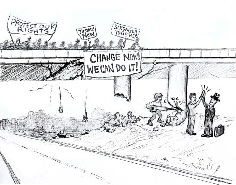

## Chapter 8: Why Don't More People Stand Together?

A human nation is a living organism. And just like a tree or lion or ant colony, a human nation can become injured.

Any disrespect between two people is a type of cultural injury, not just a personal concern. Nancy Basket, a woman of Cherokee descent, says, "If there is trouble in a family, the whole nation suffers."[xxx-basket interview] Martin Luther King Jr echoed this when he wrote, "Injustice anywhere is a threat to justice everywhere."[xxx-letterfromjail.com]

Like all living organisms, injured human nations try to heal themselves. Healthy human nations heal their wounds of disrespectful behavior by deeply addressing the trouble and bringing back a baseline of mutual respect. This is the essence of cultural healing.

Human nations become unhealthy when they are blocked from healing by rich and powerful people who benefit from disrespecting and exploiting their neighbors. These people selfishly resist returning to that respectful baseline that humans find so fundamentally satisfying.

Rulers and other authorities in positions of power would clearly lose their current ability to dominate and exploit everyone else if their unhealthy nation were to change. Thus they use their wealth and power to make sure the unhealthy nation and all its deep disrespect continue.

What are common ways that rulers and lower authorities prevent cultural healing, blocking people from standing together in solidarity to collectively stop injustices? And what can people do to intentionally generate a nation that maximizes solidarity and encourages deep respect for all?

### Sabotaging Solidarity in Unhealthy Nations

Authorities and wealthy people sabotage solidarity in many ways.

#### Attacking our Spiritual Leaders

"Spirituality" is simply how a person relates to themselves and the world, and spiritual leaders help people relate to the world in a good way. A spiritual leader is anyone who helps their people confront injustice, corruption, selfishness, confusion, shame, poverty, low self-worth, disconnection from the Earth, and other troubles. Spiritual leaders commonly help people share, build up their self-worth and dignity, help them reconnect with the Earth, and remind them that they have a proud ancestry as they bring people together to confront injustices.

The modern-day term for spiritual leader is "social activist." Whether they are called "social activists" or "spiritual leaders," they are the ones who show the most bravery, wisdom, and generosity as they bring people together to confront injustice. Unfortunately, because spiritual leaders confront the oppression that benefits the wealthy and powerful, selfish authorities commonly attack them and undermine their efforts.

Authorities around the world have found many ways to attack social activists, the spiritual leaders most willing to confront injustice in their unhealthy nation.

In the mid-1900s, East German police developed a practice called _Zersetzung_, meaning disintegration or decomposition. This police practice drove activists to mentally, emotionally, and socially disintegrate without any explicit use of force. The police arranged for various government bureaucracies to lose citizens' forms, take longer than usual to respond to citizens' inquiries or requests, or otherwise seriously frustrate the lives of activists. East German police would sabotage people's reputation. They fabricated and circulated love letters or evidence of illegal behavior among an activist's friends and family in order to sabotage relationships, and they often succeeded.[xxx-moving things around]

They also surveilled activists to dig up and publicize any private behaviors they might want hidden, such as drug use or criminal records. They might make appointments or order goods in the activist's name. They would even manipulate a person's home, secretly entering and rearranging items like clothes and only removing things no burglar would snatch, such as a single piece of important mail. They might secretly damage a bike or car. Activists would start to doubt their memory and their ability to live a functional life. Police might cause strange noises on a phone line, repeatedly stop and search someone, and make conspicuous visits to the activist's workplace so coworkers would be aware of the police's interest. People's careers were ruined without them even understanding why. Zersetzung was gaslighting on a massive scale.[xxx-stasi tactics],[xxx-stasi introduction],[xxx-moving things around]

Can you imagine what it would be like if the government deliberately made your life as difficult as possible, just because you confronted injustices with your neighbors?

There are many other examples of this kind of bureaucratic assault, including reputation sabotage. For instance, in the 2010s the US decided to have Julian Assange accused of sexual assault in Sweden after Assange revealed huge numbers of war crimes and deceit by US political leaders. The original Swedish prosecutor Eva Finne acknowledged, "There is no suspicion of any crime whatsoever." However, corrupt politics won out, and continual political persecution resulted in Assange being trapped for over a decade in an embassy and later a British prison.[xxx-cook assange finne]

Authorities may also audit the taxes of activists to force them to waste huge amounts of time. In 2022, American Matt Taibbi was busily exposing documents showing how the US government pressured a social media company to censor content. Three weeks later, the US federal tax authority (IRS) opened an investigation of Taibbi. Fortunately, powerful politicians contacted the IRS on Taibbi's behalf, and the IRS agents decided Taibbi didn't owe any taxes after all.[xxx-nypost taibbi]

Authorities may also take a more direct approach to thwarting social activism: simply murder the social activists. Famous social activists include Jesus Christ and Martin Luther King Jr. Jesus Christ consistently broke the law to feed[xxx-bible esv|mark 2:23-24] and heal[xxx-bible esv|matthew 12:10] people who needed it, and he even attacked moneylenders for profiting in the Temple.[xxx-bible kjb|mark 11:15-18] He associated with Zealots, known for resisting Roman rule, including having at least one Zealot among his disciples.[xxx-britannica jewish overview],[xxx-worldhistory jewish zealots] He kept serving his people in the most meaningful ways he could, knowing he would be killed for it.[xxx-bible kjb|mark 9:31],[xxx-bible niv|mark 10:32-34] Finally the authorities arrested and nailed him to a cross and left him to die in public along with two other revolutionaries. It was normal for Roman authorities to publicly torture revolutionaries to death with crucifixion in order to scare everyone else into submission.[xxx-worldhistory jewish zealots]

The death of Martin Luther King Jr offers another example. King lead or supported many civil rights efforts in the United States to improve the treatment of black people in the 1950s and 1960s.[xxx-georgiaencyclopedia king] Over time, he also took a stand against imperialism, even acknowledging the hypocrisy of the US attacking the Vietnamese while claiming to value democracy.[xxx-king vietnam speech] Like Jesus Christ, King carried on his work even knowing it would cost him his life, even acknowledging this in a speech the night before his assassination.[xxx-mlk final speech afscmd]

On April 4, 1968, a sniper murdered Martin Luther King Jr. The government arrested and convicted James Earl Ray for this act, but a great deal of evidence indicated that someone else had actually killed Martin Luther King Jr.[xxx-ratical king memphis trial]

In the following decades, activists were able to gather copious evidence that the US government had killed Martin Luther King Jr, and they presented their case at a civil trial in Memphis, Tennessee in 1999. Because they could not sue government officials directly, King's family sued a private citizen named Loyd Jowers as well as "Other Unknown Co-conspirators." Loyd Jowers had admitted he was involved in King's death, and these "unknown" co-conspirators were the police and intelligence agencies that couldn't be sued directly in court. The purpose of the trial was for the King family to publicly share evidence that intelligence agencies and federal and local police conspired to execute Martin Luther King Jr.[xxx-ratical king memphis trial]

Trial evidence showed that the defendant, Jowers, had said in a recorded meeting that he had helped plan King's death with the Memphis police department. Several witnesses testified that the sniper was on the ground, not in a balcony as the police claimed, and police never gathered these witnesses' testimony. The scope on the supposed murder weapon was not sighted, so as judge Joe Brown said, it "literally could not have hit the broadside of a barn." Also metallurgical tests indicated that the bullet which killed King had a different metallic composition than those in James Earl Ray's supposed murder weapon.[xxx-ratical king memphis trial]

The civil trial court ruled in favor of the Kings, agreeing that the evidence indicated that Jowers and "Unknown Co-conspirators" had indeed killed Martin Luther King Jr.[xxx-ratical king memphis trial]

#### Attacking Groups

The Nazis worked diligently to scare Germans into submission in the 1930s. Bruce Bettelheim described how a group of activist lawyers objected to various Nazi policies, and so the German police arrested all their leaders.[xxx-bettelheim]

This led to group members believing they were safe as long as they stayed out of leadership positions. The Nazis did not want any public opposition, so they began arresting lawyers essentially randomly across the group to scare everybody into submission. Nobody was explicitly told why they were arrested, but they all learned in prison that it was due to their activism work. The Nazis left a few leading lawyers in place when this was useful to them.[xxx-bettelheim]

Infiltration is particularly devious, where undercover police officers or contractors will pretend to be activists and participate in social movements. In 2011, eight British women activists filed a lawsuit stating they were tricked into having long-term relationships with police who sabotaged their efforts to reduce animal cruelty and pollution going back to the 1980s. Prosecutors and police chiefs set up 12 "inquiries" to investigate police misconduct, but all took place in secret and there has been no sign of change. Some of the women even had children with the undercover police who had secretly undermined all the good work they were doing.[xxx-guardian family spy]

The Tsarist Russian secret police provide more examples of police infiltration. Helpful informants were more likely to get into university or get a job, while incorruptible activists were denied. One police chief even allowed infiltrators to engage in illegal behavior to earn the trust of the real activists. Infiltrators were trained in all the fashionable revolutionary and socialist theories, and whenever an activist group seemed to settle on one theory, the infiltrators would start advocating for an opposing one, never letting the group settle on a coherent understanding of their problems and what to do about them. The manipulation ran deep![xxx-watchful state|p8-12],[xxx-bailey police socialism]

These techniques are all devious, but they're still far from ideal for authorities. Ideally activists would never start their own groups, but join government-sponsored organizations where they can be most easily surveilled and controlled.

 
<i>People who benefit from injustice sabotage efforts to stop it.</i>

#### Astroturf Social Movements

Authorities may also start their own _astroturf social movements_, groups of organizations that claim to be grassroots but are actually controlled by the authorities from the start. If there were no social justice movement, angry people might start their own and it might become revolutionary. But if authorities could create their own social movement they secretly control, activists might join it and invest huge amounts of time and energy into a movement which only sets moderate goals and does not achieve deep change.

As one example from the early 1900s, secret police in Tsarist Russia secretly started trade unions that acted as if they were independent. Many thousands of workers joined, excited to be part of a movement for better wages and better working conditions. S. V. Zubatov, a secret police chief, had the "movement leaders" host pro-monarchy classes so that workers would think of the Russian monarch as supportive and wise rather than selfish. The unions would pretend to negotiate with factory owners about wage increases, while the real negotiations were happening between the factory owners and the police chief.[xxx-bailey police socialism],[xxx-russian secret police|okhrana age assassinations]

Tens of thousands of workers joined Russian labor unions secretly controlled by the police, thinking they were all coming together to seek meaningful change. The workers legitimately wanted that change and worked hard for it, not knowing that the leadership was directing their energy in a way that they would only see moderate improvements at best.[xxx-russian secret police|okhrana age assassinations]

Imagine if you spent hundreds of hours supporting such a labor movement, tired of the poor wages, long hours, and dangerous work environments. How would you feel if you discovered later that it was being manipulated by the most powerful people in your society to prevent meaningful change?

A similar manipulation is playing out in the United States with the Black Lives Matter movement. In 2024, the "impact" page on blacklivesmatter.com proclaimed "We are building an institution to fight white supremacy."[xxx-blacklivesmatter impact] The "about us" page on m4bl.org (Movement for Black Lives) stated "We are anti-capitalist."[xxx-m4bl about us] Yet the movement is heavily funded by some of the wealthiest white capitalists on the planet, including the people behind the Ford Foundation who donated more than $840,000,000 to Black Lives Matter-related organizations 2011 and 2021.[xxx-fordfoundation 665]

The Ford Foundation is the "philanthropic" organization based on the wealth of white capitalist Henry Ford, founder of the Ford car company. As early as 1951 it had ties with the US Central Intelligence Agency (CIA), which requested its help doing psychological warfare operations in Asia.[xxx-cia request ford foundation help psych warfare] With this background in psychological warfare, the Ford Foundation already had experience deceiving and manipulating whole societies in service of US imperialism. Do you think it might use the same manipulative techniques in the US, further refined after decades of practice?

The Ford Foundation was already known in the 1960s and 1970s for funding "moderate" political groups to try and attract black people away from revolutionary movements like the Black Panthers.[xxx-rockarch ford 60s race activism]

Ford Foundation directors have included some of the most politically connected American capitalists, including John McCloy who also worked as president of the World bank, high commissioner for Occupied Germany after World War II, assistant secretary of war, and chairman of Chase Manhattan Bank.[xxx-britannica mccloy] Other rich donors to Black Lives Matter-related groups include multi-billionaires Mark Zuckerberg[xxx-chan zuckerberg blm donation] (ceo of Facebook) and Pierre Omidyar[xxx-omidyar equity transformation] (cofounder of eBay).

Just as the vast majority of activists in the astroturf Russian labor unions legitimately wanted change, many honest, well-meaning activists have supported Black Lives Matter. But sadly, the most influential people -- the funders and their choice of organizations and leaders they fund -- have found ways to direct that activist energy to effectively seek only moderate change and avert deep change.

After 10 years, what was there to show? Many wealthy and powerful people implemented superficial changes that might feel rewarding and give the appearance that Black Lives Matter was making progress, but which do not end the oppression of black people. The government announced a new federal holiday called Juneteenth in honor of the end of chattel slavery. Companies like Zoom and Google allow people to choose their skin color in their profiles. Some large news companies and publishers have decided to go all-out by capitalizing the letter "b" when writing about black people.[xxx-ap capitalize black] Wow, what progress!

Many companies include (or used to include) some variation of "diversity, equity, and inclusion" projects geared towards helping employees get along and work productively together. Corporate officers that claim to oppose racism commonly discuss microaggressions that hurt an individual's feelings but do not address the massive macroaggressions which generate systems of prison slavery.[xxx-shrm microaggressions corporation]

What are those macroaggressions that a grassroots liberation movement might inspire people to fight against?

Consider the real mechanisms keeping black people oppressed in the United States. When police spend extra time patrolling poor black neighborhoods and black people get longer prison sentences than whites for the same offense, black people end up spending much more time in prison than white people for the same crimes.[xxx-odoc|ch20] Police commonly commit perjury in court when it suits them, as found in repeated academic studies spanning decades and acknowledged by many police officers, judges and lawyers themselves in interviews, meaning that the legal system knowingly tolerates false evidence.[xxx-odoc|ch32] Studies show that 98% of federal prisoners plea-bargain, meaning they are threatened with such long prison sentences that they plead guilty in exchange for a shorter sentence. Plea bargaining sends people to prison whether or not they are actually guilty without going to trial.[xxx-npr plea bargain]

Federal prisoner surveys in 2008 showed that prison sexual assault is so rampant that, when combined with sexual assault rates outside of prison, there are more male-victim sexual assaults than female-victim in the United States.[xxx-odoc|ch24] Prisoners cannot legally choose not to work, and even if they could legally decline, prison administrators commonly violate the law with impunity, meaning they would force prisoners to work whether it was legal or not.[xxx-odoc|ch36]

This would all be bad enough if drug use were a terrible crime that could only be stopped by imprisoning people, but researchers find that drug-treatment programs reduce both drug-use and crime more than imprisonment. In fact, research shows that going to prison increases drug use.[xxx-release from prison - a high risk of death for former inmates],[xxx-addiction should be treated, not penalized],[xxx-tops drug study|3]

John Ehrlichman was White House counsel in the Nixon administration, and he admitted that the whole "war on drugs," which has sent millions of people to prison, was implemented specifically to persecute people who opposed the rulers' oppressive policies. He told a reporter in 1994, "the Nixon White House... had two enemies: the antiwar left and black people... We knew we couldn't make it illegal to be either against the [Vietnam] war or black, but by getting the public to associate the hippies with marijuana and blacks with heroin, and then criminalizing both heavily, we could disrupt those communities. We could arrest their leaders, raid their homes, break up their meetings, and vilify them night after night on the evening news. Did we know we were lying about the drugs? Of course we did."[xxx-harpers magazine real purpose drug war]

This is what prison slavery looks like in the United States right now: vast numbers of black people (and people from other groups, mostly poor) are in prison without having a fair trial, are often persecuted by dishonest police and judges who knowingly tolerate perjury, are forced to work, are commonly threatened with sexual assault, and are sentenced to disproportionately long sentences. And all because of activities that, in many cases such as drug possession, shouldn't be considered crimes in the first place.

How would you feel if you were unjustly trapped in such an abusive prison system? How would you feel if your parent or sibling or child were trapped, and you couldn't see them day after day for years or decades?

How do you feel knowing that if you worked with others to free unjustly imprisoned people, such as by confronting the responsible politicians, judges, police, or prison wardens, you would be punished? Even prison reform-activists can only ask authorities to pursue justice. They're not allowed to directly seek justice themselves, as any interference with the legal system is strictly forbidden and heavily punished. This is what it means to live in an unfree society -- you're stuck with unjust laws which are unfairly enforced, like the war on drugs, and you would be punished for seeking justice.

This oppression profoundly benefits the rich, as it discourages and disrupts the deep solidarity needed to end the injustices black people face in so many areas of life. Thus the rich keep getting richer while many black people and other disadvantaged groups remain in relative poverty.

Black Lives Matter organizers proclaim they are anti-white supremacy and anti-capitalist. But do you think that a movement so heavily funded by rich white capitalists will end the oppression that benefits them so much?

Black Lives Matter isn't the only astroturf movement in the United States. For example, the multibillionaire Koch brothers have spent over $160 million to fund at least 90 "independent" research and opinion organizations to trick people into thinking climate change is fake -- all to protect their investment in their oil and chemical company.[xxx-greenpeace koch]

Creating and controlling astroturf social movements is common in unhealthy nations where a few powerful people control vast wealth and work to keep it at any cost.

Whether attacking activists, undermining social movements, or sponsoring astroturf social groups, authorities selfishly work to undermine solidarity in order to maintain the status quo. If people wanted to create a nation without this deep selfishness, how might they do this?

Revolutionary Activity #12 Channel your anger

How do you feel reading about such profound corruption in the "justice system"? How do you feel knowing that, since you live in an unfree, unhealthy nation, you would be punished if you confronted legal authorities to seek real justice for the prisoners?  If you feel anger or other difficult feelings reading about this, that's ok. The energy behind those feelings is a gift; it's the energy that can motivate you to help stand for real justice. Remember that you're not alone, and plenty of people want justice just like you. Find a productive way to channel that energy, such as by confronting injustices where you live, educating others, or helping found a new healthy nation where people would never tolerate such abuses.

### A Case Study in Creating a Society that Chooses Generous Servant-Leaders: The Haudenosaunee

Imagine living in a society where the leaders are the most generous, and where the leaders encourage deep solidarity and connection instead of sabotaging it. Imagine a society where activists who confront injustice are rewarded with gratitude instead of punishment.

This is not a fantasy, but the normal way people live in healthy nations. The Haudenosaunee's traditional leaders were their spiritual leaders, and were expected to be extremely generous. Leaders "act[ed] more as conduits of the will of the people than as independent representatives of the people,"[xxx-basic call to consciousness|p38] and "when they don't perform, the will of the people will remove them."[xxx-original instructions|a democracy based on peace]

What sort of society would have the spiritual strength to choose leaders like this, and to replace any leader who does not live up to their standards? In their book _A Basic Call to Consciousness_, Haudenosaunee writers summarized many crucial aspects of their society that have allowed them to live this way for over nine centuries.

Long ago, several nations in eastern North America were suffering from a long period of violence, and eventually they decided to create a confederacy to ensure lasting peace. This became known as the Haudenosaunee Confederacy, also known as the Iroquois, which has survived as a healthy nation for over 900 years.[xxx-encyclopedia haudenosaunee|p265]

It is impossible to briefly recount all the ways the Haudenosaunee have maintained a healthy nation for so long, but I believe these elements have many lessons to teach: 

1. _Solidarity_: As one people, they stood in solidarity to ensure that if anyone were attacked, the entire Confederacy would respond.[xxx-basic call to consciousness|p35],[xxx-basic call to consciousness|p37]

    Everyone was trained from birth to uphold the agreements of their society, and to defend anyone who was oppressed. They did not just make a strong government to keep them safe. They created a spiritually strong society of individuals who accepted responsibility for upholding rules that worked for everybody.[xxx-basic call to consciousness|p39]

2. _Intentionally Avoiding Causes of Past Conflicts_: The founders studied causes of past conflicts and created a Grand Council that helped resolve disputes, among other functions.[xxx-basic call to consciousness|p34]

3. _Acknowledging the Earth's Needs_: The traditional Haudenosaunee took the nonhumans' needs into account, embracing strict laws of conservation and carefully avoiding degrading the land.[xxx-basic call to consciousness|p104]

    As a result, the Haudenosaunee lived with an "almost unimaginable abundance... of nuts, berries, roots, and herbs... the rivers teemed with fish and the forest and its meadows abounded with game..."[xxx-basic call to consciousness|p104]

4. _Achieving Peace by Standing for Justice_: When there is no justice, "peace" is actually submission. The Haudenosaunee's founders prioritized justice, saying that "if absolute justice was established in the world, peace would naturally follow."[xxx-basic call to consciousness|p104] They even prioritized justice over rigid rules, noting "the society was founded on concepts of moral justice, not statute law."[xxx-basic call to consciousness|p38]

5. _Rejecting Private Property_: The traditional Haudenosaunee wisely rejected private property and emphasized sharing. They wrote, "That idea (property) would produce slavery...[and] would destroy our culture, which requires that every individual live in service to the Spiritual Ways and The People."[xxx-basic call to consciousness|p105] They established the rule that "no one has a right to a greater share of the wealth of society than anyone else."[xxx-basic call to consciousness|p38]

    Since the Haudenosaunee avoided selfishness, they did not need to fear anybody mooching off others' hard work and generosity.

6. _Avoiding Conquering Other People_: They committed to never impose taxes or religion on anyone they defeated in war. While the Haudenosaunee were willing to keep fighting a war until the threat was fully addressed, adversaries could call for a cessation of hostilities at any time. They committed to never have a society where a few people ruled over the rest, even when they won the war and could be the rulers![xxx-basic call to consciousness|p37]

7. _Leaders Serve the People_: They avoided factions,[xxx-basic call to consciousness|p34] and no government imposed laws on anyone. Their leaders were expected to be generous.[xxx-basic call to consciousness|p104]

What was the end result of a society based in part on these principles? Whereas one encyclopedia defines a "utopia" as "impossibly idealistic"[xxx-britannica utopia], the Haudenosaunee writers described how, prior to the arrival of European unhealthy nations, "It was, in fact, a kind of Utopia, a place where no one went hungry, a place where the people were happy and healthy."[xxx-basic call to consciousness|p104]

Even centuries ago, the Haudenosaunee sometimes went through hard times such as famines or wars. This shows that living in a utopia doesn't mean life is easy. It means that you can trust the people around you to take care of each other when challenges arise.

These principles show the importance of spiritual strength and what it means to live in a free society. When everyone in a nation has the spiritual strength to stand for what's right, each person will expect everyone else to likewise have that strength. And when everybody is expected to stand for justice, then justice and mutual respect become normal, and that's what a free society looks like.

Part 3 offers a practical path to begin building a healthy nation, starting with cultivating your spiritual strength and forming new healthy communities where people hold each other to high standards of good behavior so that integrity and generosity become normal, and trust is pervasive.

Not everyone will want to walk this path, but you can find people who do. As healthy communities form, they will be the building blocks of future healthy nations that embrace a respectful way of life among the people, and between the people and the Earth.

### References

[xxx-tops drug study|3]-aaa (Drug Abuse Treatment Evaluation, 1983, 3)

[xxx-release from prison - a high risk of death for former inmates]-aaa (Binswanger et al., 2007)

[xxx-addiction should be treated, not penalized]-aaa (Volkow, 2021)

[xxx-encyclopedia haudenosaunee|p265]-aaa (Johansen & Mann, 2000, 265)

[xxx-bible niv|mark 10:32-34]-aaa (Mark 10:32-34, New International Version Bible)

[xxx-mlk final speech afscmd]-aaa (King Jr, 1968)

[xxx-bible kjb|mark 9:31]-aaa (Mark 9:31, King James Version Bible)

[xxx-letterfromjail.com]-aaa (King Jr, 1963)

[xxx-stasi introduction]-aaa (Introduction - Ministry for State Security, n.d.)

[xxx-stasi tactics]-aaa (Hertzgerg, 2021)

[xxx-basket interview]-aaa (N. Basket, personal communication, August 5, 2023)

[xxx-moving things around]-aaa (Stuchbery, 2019)

[xxx-cook assange finne]-aaa (Cook, 2020)

[xxx-bible kjb|mark 11:15-18]-aaa (Mark 11:15-18, King James Version Bible)

[xxx-georgiaencyclopedia king]-aaa (Kirk, 2020)

[xxx-worldhistory jewish zealots]-aaa (Denova, 2022)

[xxx-ratical king memphis trial]-aaa (Douglass, 2000)

[xxx-king vietnam speech]-aaa (King Jr, 1967)

[xxx-nypost taibbi]-aaa (Nelson, 2023)

[xxx-britannica jewish overview]-aaa (Gaster & Dimitrovsky, 2024)

[xxx-bettelheim]-aaa (Bettelheim, 1943)

[xxx-bailey police socialism]-aaa (Bailey, 1957)

[xxx-watchful state|p8-12]-aaa (Daly, 2004, 8-12)

[xxx-guardian family spy]-aaa (Evans & Lewis, 2012)

[xxx-russian secret police|okhrana age assassinations]-aaa (Hingley, 2021, "The Okhrana in the Age of Assassinations 1901-1908")

[xxx-blacklivesmatter impact]-aaa (Impact, n.d.)

[xxx-rockarch ford 60s race activism]-aaa (Wimpee, 2020)

[xxx-omidyar equity transformation]-aaa (2021 Tax Form 990-PF for Omidyar Network Fund, Inc, n.d.)

[xxx-chan zuckerberg blm donation]-aaa (2021 Tax Form 990-PF Chan Zuckerberg Initiative Foundation, n.d.)

[xxx-cia request ford foundation help psych warfare]-aaa (Director of Central Intelligence, Assistant Director, Research and Reports, 1951)

[xxx-m4bl about us]-aaa ("About Us," n.d.)

[xxx-fordfoundation 665]-aaa (Ford Foundation Announces $180 Million in New Funding for U.S. Racial Justice Efforts, 2020)

[xxx-britannica mccloy]-aaa (The Editors of the Encyclopedia Britannica, n.d.)

[xxx-shrm microaggressions corporation]-aaa (For example: 10 Microaggressions Companies Must Avoid, n.d.)

[xxx-ap capitalize black]-aaa (Daniszewski, 2020)

[xxx-odoc|ch20]-aaa (Randolph, 2024, "Chapter 20: Imposing And Maintaining Racism vs Generating Unity")

[xxx-odoc|ch24]-aaa (Randolph, 2024, "Chapter 24: Sexual Discrimination vs Sexual Equality")

[xxx-harpers magazine real purpose drug war]-aaa (Baum, 2016)

[xxx-greenpeace koch]-aaa ("Koch Industries: Secretly Funding the Climate Denial Machine," n.d.)

[xxx-odoc|ch36]-aaa (Randolph, 2024, "Chapter 36: Sabotaging Efforts at Deep Cultural Healing")

[xxx-odoc|ch32]-aaa (Randolph, 2024, "Chapter 32: A Study in Privilege and World-Shaping - the Police")

[xxx-npr plea bargain]-aaa (Johnson, 2023)

[xxx-original instructions|a democracy based on peace]-aaa (Nelson, 2008, "A Democracy Based On Peace")

[xxx-basic call to consciousness|p38]-aaa (Notes, 2005, 38)

[xxx-basic call to consciousness|p105]-aaa (Notes, 2005, 105)

[xxx-britannica utopia]-aaa (Utopia, 2024)

[xxx-basic call to consciousness|p34]-aaa (Notes, 2005, 34)

[xxx-basic call to consciousness|p39]-aaa (Notes, 2005, 39)

[xxx-basic call to consciousness|p35]-aaa (Notes, 2005, 35)

[xxx-basic call to consciousness|p104]-aaa (Notes, 2005, 104)

[xxx-basic call to consciousness|p37]-aaa (Notes, 2005, 37)

[xxx-bible esv|mark 2:23-24]-aaa (Mark 2:23-24, English Standard Version Bible)

[xxx-bible esv|matthew 12:10]-aaa (Matthew 12:10, English Standard Version Bible)