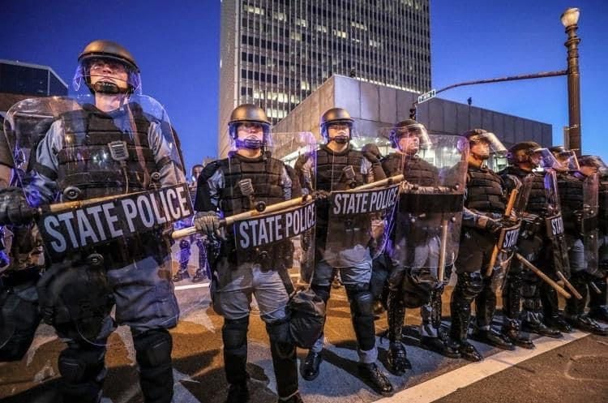

## Chapter 6: Why Are We So Lost?

Everybody is born with a sense of dignity, meaning that we each have a natural impulse to _stand for what's right_ for ourselves and our neighbors.

As I studied healthy cultures, I repeatedly saw a common response in times of trouble: people come together, discuss the problem, and consider how to respond collectively so they can return to that respectful way of life that all humans expect from birth.

People born and raised in healthy cultures would be shocked if their leaders started giving money or special treatment to the rich while many people went hungry or lived a precarious life. Or if rich businessmen used violent thugs to suppress people's efforts to get safe working conditions. Or if police arrested someone for saying the truth. Or if a loved one was falsely convicted of a crime, and the racist or sexist judge showed no interest in real justice.

And they would be shocked if they were threatened with severe violence for trying to end these injustices.

But for many of us living in the United States, Spain, Russia, China, Egypt, and every other unhealthy culture around the world, such unjust behavior is not so shocking, is it?

Various groups of people have tried countless times over centuries to come together and seek justice. And when they do, what do they see?

Regardless of the particular country, or the type of government or economy, when people seek justice in unhealthy cultures, they see a similar response.

In Venezuela, people standing up for themselves and seeking justice see this:

 
Riot Police in Venezuela

 

In communist China, they see this:

 
Riot Police in China

 
And in the capitalist United States, they see this:

 
Riot Police in the United States

 
I was taught growing up that the police's job is to keep people safe and enforce the law. But the riot police consistently protect the interests and possessions of the rich and powerful even when they are clearly violating the law.

And who are the police protecting the rich and powerful from? Of course, they are protecting the rich and powerful from people who are angry about low wages, pollution, corruption, wars based on lies, and all the usual injustices in unhealthy cultures. The police are actually employed to scare people away from standing up for themselves, and to punish people for collectively seeking justice.

In unhealthy cultures, where people are forbidden from holding their leaders accountable or standing with others to seek justice, is it any wonder that leaders indulge in corruption, crime, and domination?

As I was born and raised in an unhealthy culture, all this seemed normal and natural to me until I discovered healthy cultures where people do not live this way. Every single human feels a deep urge to stand up for what's right in their culture, and unhealthy cultures systematically train people from childhood to "hold back" or "shut down" parts of themselves so they won't honor this urge to stand for what's right.

In healthy cultures, standing for what's right in solidarity with neighbors is not just encouraged -- it's expected. Everyone agrees on their laws, and everyone is expected to uphold them to ensure they can maintain a respectful way of life. Children are trained from birth to have the courage to consistently uphold their laws with integrity.

This shows why so many people of unhealthy cultures are lost, with ineffective politics and endless corruption, greed, discrimination, and pollution, no matter who people vote for. When the path to universal justice is outlawed -- because people are forbidden from taking responsibility to stand for what's right -- injustice and ineffective political movements become normalized.

Can you imagine living in a culture where everyone accepts responsibility for standing up for what's right and upholding their laws, with each person acting in solidarity with everyone else to ensure that no one is mistreated?

### The Nootka Stand in Solidarity

In the book _Daughters of Copper Woman_, a Nootka storyteller described a cultural technique the Nootka used to help people see their own foolish behavior: people who acted like mirrors, helping people see their own silly or foolish behavior by imitating it.

These "mirror" people were like magazine opinion writers who commented on all sorts of things. If a mirror thought that the council was about to do something foolish, they might show up at council and imitate one of the leader's every moves so that "every little wart on that person would show, every hole in their idea would suddenly look real big."

If a person were vain about their clothes, a mirror might follow behind them wearing tattered rags and their hair would be like a bird's nest full of mud and sticks, all looking similar to the vain person. If a person had a bad temper, a mirror might follow and have fits, hitting the sand with a rock or insulting birds and generally looking foolish. If a person became self-important, the mirror might follow along babbling like a baby, "until you finally heard what an ass you were bein'." And if a mirror started being mean or pushy, a second mirror might follow along and let the first one see how they were showing up.

The Nootka storyteller noted, "nobody would ever dare blow up at the [mirror]!" Anyone who did would be shamed. Mirrors did not make fun of people or act hurtfully. They helped people see what they looked like to others and how silly it was to put so much emphasis on unimportant things like clothes or jewelry, "instead of what counts, like bein' nice to people, and bein' lovin'..."

Christians arrived and started dividing up the land. They set up a church, and began trying to get the Nootka to attend, offering glass mirrors and other trinkets as enticements. At church, the preacher told them what to wear, how to live, and what to do. He insisted that men shouldn't wear kilts, and women should only have long dresses that covered them completely. He kept saying that everyone should live and dress like the white man.[xxx-Cindy: added "glass" mirrors to distinguish from human-mirrors]

One day, a mirror from a nearby community arrived at the church. Like the white man, she wore a big black hat and a black jacket. She even wore old rundown shoes someone had thrown away. Unlike the white man, she wore nothing else. 

She moved to the front and waited for church to start.

The preacher got very upset, but everyone else looked at her respectfully. No one mocked her or looked away to avoid her nakedness.

The preacher started ranting about nudity, naked women, sin, and respect for God. Then he came down from his pulpit and grabbed the mirror to throw her out!

Acting violently towards a mirror was absolutely not allowed, and the storyteller said, "The people just about ripped him apart." But the mirror protected him from the crowd, went up to where the preacher had been, and began speaking.

The mirror first encouraged empathy, asking people to imagine how a stranger might feel, being away from home and surrounded by people who looked and acted differently. Then she reminded her neighbors of the beauty of their respectful way of life when she said, "there was more than one kind of mirror. There was the white man's mirror that you got if you went to church, but there was the mirror in the eyes of the people you loved..." She warned the crowd about following anybody "who was so mixed up they'd do forbidden things."[xxx-Cindy: is this still clear with all the uses of the word mirror?]

I feel impressed that this woman calmly but clearly confronted the preacher's hurtful attitudes. She even invited her neighbors to have compassion for a stranger after he'd acted rudely. I also feel impressed that the people immediately recognized who was in the right and acted in support of the mostly-naked woman instead of the self-righteous man. This story showed me that whole communities can act in solidarity and stand for a culture of mutual respect when conflict arises.

This story showed me what it's like when everyone in a culture upholds the rules for how people treat each other. The Nootka didn't have police; everybody took a stand to protect the clown when she was attacked. They had rules that worked for everyone, and everyone upheld them.

And this solidarity was not a one-off event. It was a way of life. The clown walked out of the church, and all the people followed her, leaving the preacher alone. That church still exists and remains empty to this day.

This solidarity can only exist if neighbors act generously with each other. If selfishness is widespread, it is naturally hard for people to trust each other to stand for what's right, even at great personal risk.

### Solidarity and Generosity Used to be Universal
[xxx-cindy: this closing section moved from the econ chapter]
A few thousand years ago, every human alive lived in a healthy culture where solidarity and widespread generosity among neighbors was simply normal and expected. Since then, unhealthy cultures have formed and slowly spread around the world, trapping free people in exploitative societies where a few people rule over the rest. How have rulers trained conquered people not to have the personal strength to stand for what's right, instead tolerating endless exploitation, discrimination, pollution, and corruption? And how do healthy cultures train people instead to have that deep personal strength to stand for what's right at any cost?

To explore deep spiritual training, join me in _Chapter 6: Heart-Closing vs Heart-Opening_.

### References

[xxx-Cindy: added "glass" mirrors to distinguish from human-mirrors]

[xxx-Cindy: is this still clear with all the uses of the word mirror?]

[xxx-cindy: this closing section moved from the econ chapter]
